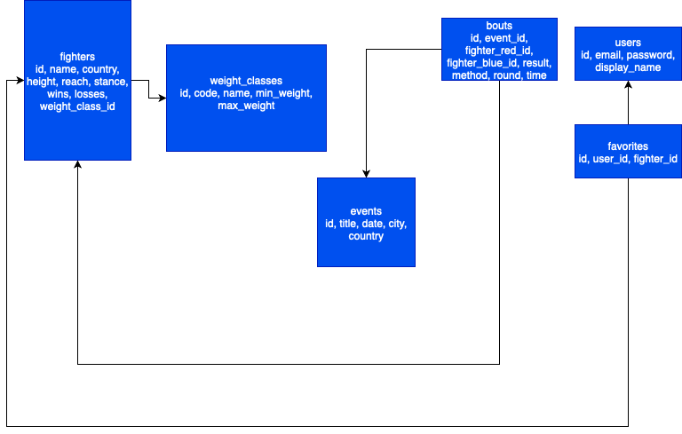

# Best UFC Fighters — MMA Knowledge Hub

A simple website to explore the best UFC fighters by weight class.  
Fans can browse fighter profiles, rankings, events and bouts, compare fighters, and save favorites.

---

## REST API Endpoints

### Fighters
- **GET /api/v1/fighters** — list fighters  
- **GET /api/v1/fighters/{id}** — fighter details  
- **POST /api/v1/fighters** — add fighter (admin)  
- **PATCH /api/v1/fighters/{id}** — update fighter (admin)  
- **DELETE /api/v1/fighters/{id}** — delete fighter (admin)  

### Weight Classes
- **GET /api/v1/weight-classes** — list weight classes  
- **GET /api/v1/weight-classes/{code}** — class details  

### Events & Bouts
- **GET /api/v1/events** — list events  
- **GET /api/v1/events/{id}** — event details with bouts  
- **GET /api/v1/bouts?fighter_id=...** — all bouts of a fighter  

### Compare
- **GET /api/v1/compare?fighter_a=123&fighter_b=456** — compare two fighters  

### Users & Favorites
- **POST /api/v1/auth/register** — register user  
- **POST /api/v1/auth/login** — login user  
- **GET /api/v1/users/me** — profile info  
- **GET /api/v1/favorites** — user favorites  
- **POST /api/v1/favorites** — add to favorites  
- **DELETE /api/v1/favorites/{id}** — remove from favorites  

---

## Database Schema (ERD)

Add ERD image here once you export from draw.io:

---

## Versioning
- All endpoints start with `/api/v1`.  
---
_This is a student project for UFC Fighters site._
